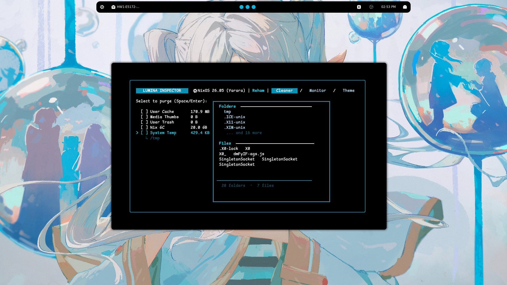

<p align="center">
  
  
  
</p>

<h1 align="center">✦ Lumina ✦</h1>
<p align="center"><b>A TUI system cleaner &amp; monitor for Linux 🐧</b></p>

<p align="center">
  
</p>

<p align="center">
  <i>Because clicking through settings panels is for peasants.</i>
</p>
<p align="center">
  <b>Built by DEV : Reham</b>
</p>

<br>

---

## Install

```bash
git clone https://github.com/PzN2s/Lumina
cd Lumina
go build -o lumina .
sudo ./lumina
```

To run it from anywhere (add to your PATH):

```bash
cp lumina ~/.local/bin/
lumina
```

> Requires **Go 1.26+** and **root privileges** (sudo / pkexec).

### Updating

> **Important:** The update command must be run from the Lumina source folder (where you cloned the repo).

From the source folder:

```bash
sudo ./lumina --update
```

Or press `u` inside the TUI. This runs `git pull` + `go build` to update to the latest version.

### Installing Go per distro

| Distro | Command |
|:---|:---|
| Ubuntu / Debian / Mint / Pop / Zorin / Elementary / Deepin / Raspbian | `sudo apt install golang-go` |
| Fedora / CentOS / Rocky / AlmaLinux | `sudo dnf install golang` |
| Arch / ArchARM / Manjaro / EndeavourOS / CachyOS | `sudo pacman -S go` |
| openSUSE Leap / Tumbleweed | `sudo zypper install go` |
| Void Linux | `sudo xbps-install go` |
| Alpine Linux | `sudo apk add go` |
| Gentoo | `sudo emerge dev-lang/go` |
| NixOS | `nix-shell -p go -p gcc`

---

## Controls

| Key | Action |
|:---:|:---|
| `↑` `↓` | Navigate items |
| `Space` | Toggle selection |
| `Enter` | Clean selected targets (with confirmation) |
| `Tab` | Switch panel |
| `u` | Update Lumina (git pull + rebuild) |
| `q` / `Ctrl+C` | Quit |

---

## Panels

**Cleaner** — Browse system cache directories, see what's inside, select what to nuke. File preview per target with animated scanning.

**Monitor** — Live dashboard with CPU, RAM, swap, disk usage, uptime, load average, GPU info (vendor, VRAM, clock speeds), and top processes sorted by memory.

**Theme** — 25 color schemes. Ocean, Forest, Sunset, Aurora, Lavender, Coral, Dusk, Slate, Rose, Amber, Indigo, Teal, Cherry, Sage, Midnight, Warm, Mellow, Twilight, Sand, Mint, Peach, Haze, Pebble, Honey, Moonlight.

---

## Distro Support

| Distro | Auto-clean | Dependency | Fallback |
|:---|:---:|:---|:---|
| Ubuntu / Debian / Mint / Pop / Zorin / Elementary / Deepin / Raspbian | yes | `apt` (built-in) | — |
| Fedora / CentOS / Rocky / AlmaLinux | yes | `dnf` (built-in) | — |
| Arch / ArchARM / Manjaro / EndeavourOS / CachyOS | yes | `pacman` (built-in) | `paccache` -> `pacman -Sc` |
| Void Linux | yes | `xbps` (built-in) | — |
| Alpine Linux | yes | `apk` (built-in) | — |
| NixOS | yes | `nix-collect-garbage` | — |
| openSUSE Leap / Tumbleweed | yes | `zypper` (built-in) | — |
| Gentoo | yes | `eclean` (from `app-portage/gentoolkit`) | — |

### Optional

```
pciutils -> lspci (GPU detection fallback, works fine without it)
```

---

## How it works

Pulls system data from `/proc`, `/sys`, and `/sys/class/drm`. GPU detection uses the kernel device tree first, falls back to `lspci`. All reads are read-only until you hit Enter in the Cleaner tab — a confirmation dialog appears, then it runs your distro's package manager cleanup commands alongside removing selected cache dirs.

Built on [`bubbletea`](https://github.com/charmbracelet/bubbletea) and [`lipgloss`](https://github.com/charmbracelet/lipgloss).

---

## License

MIT — do whatever the hell you want with it, but if you modify or redistribute it, you **must keep the original copyright notice** and credit **PzN2s**. Don't be that person who steals code and pretends they wrote it.
